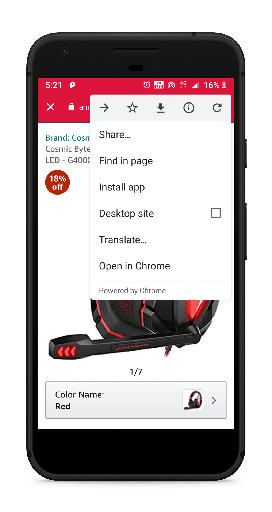

# Nativescript Chrome Tabs   


[](https://www.npmjs.com/package/nativescript-chrome-tabs)

[](https://travis-ci.org/iamabs2001/nativescript-chrome-tabs)


[](https://twitter.com/iamabs2001)

Chrome Tabs Plugin to open a custom chrome/safari tabs in android & ios.

## Installation

```
tns plugin add nativescript-chrome-tabs
```
<hr>

## Demo 

|  |  |
| ----------- | ----------- |
|  |  |

<hr>

## Usage 

```html
<Button text="click" (tap)="myCustomWeb();">
```

### Javascript

```javascript
var { initChromeTab, openChromeTab } = require('nativescript-chrome-tabs');

constructor() { 
    initChromeTab(); 
}

function myCustomWeb() {
    openChromeTab({
        url: 'http://google.com',
        toolbarColor: '#0361cc',
        toolbarControlsColor: '#303F9F'
    });
}
```

### Typescript

```typescript
import { initChromeTab, openChromeTab } from "nativescript-chrome-tabs";

constructor() { 
    initChromeTab(); 
}

myCustomWeb() {
    openChromeTab({
        url: 'http://google.com',
        toolbarColor: '#0361cc',
        toolbarControlsColor: '#303F9F'
    });
}
```

<hr>

## API (Properties)

| Property | Default | Description |
| --- | --- | --- |
| url | **required** | The URL to open |
| showTitle | false | Shows title bar in the webview |
| toolbarColor | undefined | Color of the toolbar |
| toolbarControlsColor | undefined | (only iOS) color of buttons on toolbar |
| isClosed | undefined | callback function that will be called when webview is closed |


<hr>

## API (Methods)

| Method | Type | Returns |Description |
| --- | --- | --- | --- |
| initChromeTab(); | constructor | void | To Initialize Chrome Tab |
| openChromeTab(url : String, toolbarColor : String, toolbarControlsColor : String); | method | void | To Open a Chrome Tab |

<hr>

https://developer.chrome.com/docs/multidevice/android/customtabs/